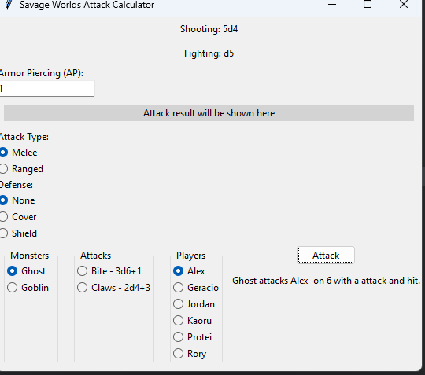

# Savage Worlds Attack Calculator


The Savage Worlds Attack Calculator is a Python-based desktop application designed to simulate attack rolls in the Savage Worlds tabletop RPG. It allows users to select attackers (monsters), targets (players), and determine the outcomes of attacks based on Savage Worlds' unique combat mechanics, including "exploding" dice and Armor Piercing (AP) values.


## Features

- **Character Selection**: Choose from a list of predefined monsters and players, each with unique stats.
- **Attack Simulation**: Perform melee or ranged attacks with dynamic calculations for damage, taking into account character toughness, AP values, and Savage Worlds' "exploding" dice mechanic.
- **Outcome Determination**: Get immediate feedback on the attack's outcome, including whether a target is shaken, wounded, or unharmed.

## Setup

To run the Savage Worlds Attack Calculator, follow these steps:

1. **Prerequisites**: Ensure you have Python installed on your system. The app has been tested with Python 3.8+.

2. **Dependencies**: Default python libraries 
3. 
3. **Clone the Repository**:
    ```sh
    git clone https://your-repository-url.git
    cd savage-worlds-attack-calculator
    ```

4. **Run the Application**:
    ```sh
    python attack_gui.py
    ```

## Usage

1. **Select a Monster and a Player**: Use the radio buttons to choose an attacker and a target.
2. **Choose Attack Type**: Select either melee or ranged attack.
3. **Input AP Value**: If applicable, enter an Armor Piercing value for the attack.
4. **Simulate Attack**: Click the "Attack" button to simulate the attack and see the outcome.

## Customization

- **Adding Characters**: To add more monsters or players, edit the JSON files in the `monsters` and `players` directories, following the existing format.

- **Adjusting Mechanics**: The core logic can be found in `attack_logic.py`. Modify it to adjust how attacks and damage calculations are handled.

## Contributing

Contributions to the Savage Worlds Attack Calculator are welcome. Please open an issue first to discuss what you would like to change or add.

## Test Summary

All unit tests run automatically via GitHub Actions.

| Logic area | Test count |
| --- | --- |
| `parse_attack_value` | 1 |
| `simulate_dice_roll` | 2 |
| `roll_damage` | 1 |
| `roll_aim` | 1 |
| `calculate_damage` | 2 |
| `determine_attack_outcome` | 1 |

## License

This project is released under the MIT License - see the LICENSE file for details.

## Acknowledgments

- Savage Worlds, for the inspiration.
- The Python community, for the invaluable resources and libraries.
